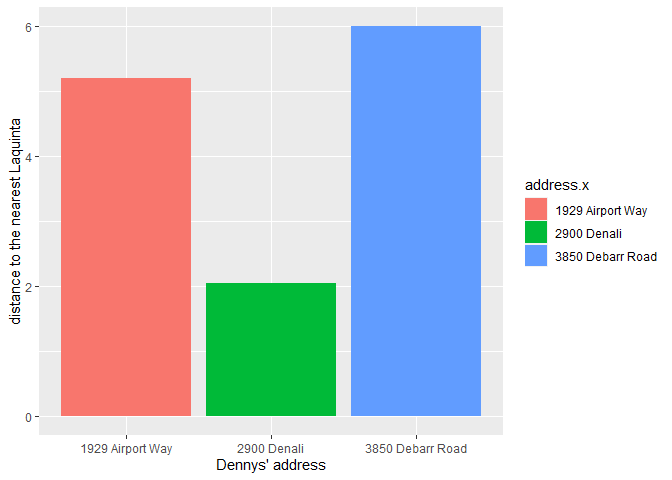
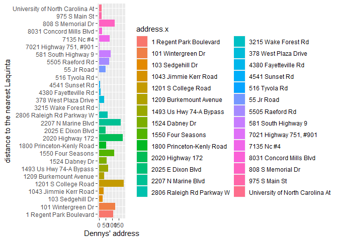
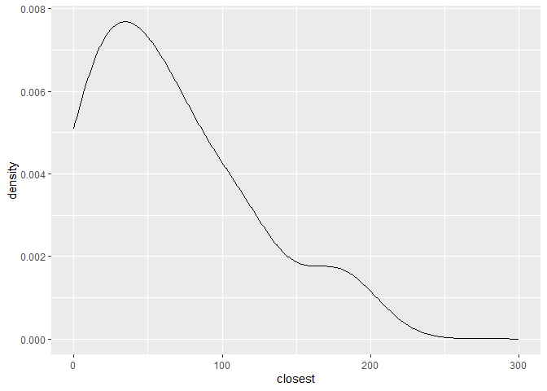
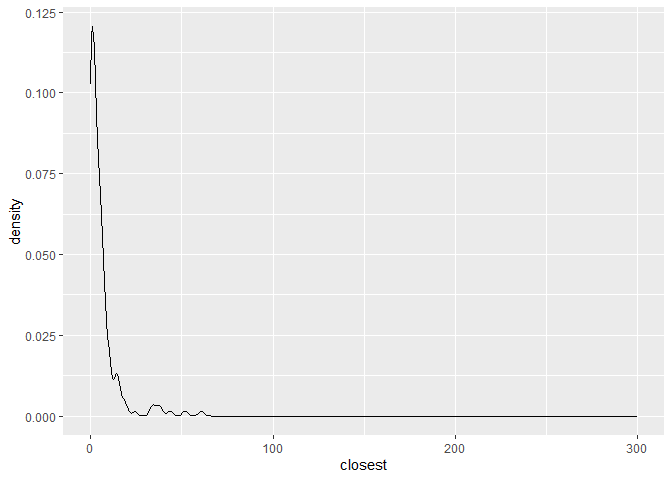
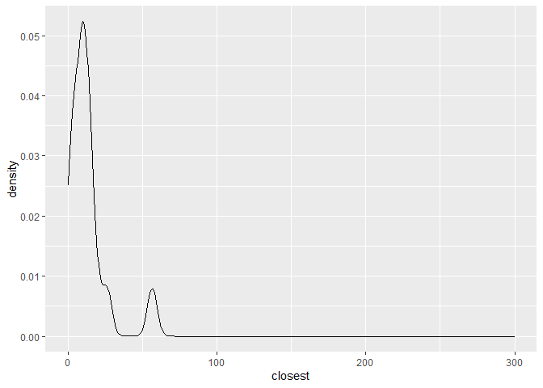

Lab 05 - La Quinta is Spanish for next to Denny’s, Pt. 2
================
Qilin Zhang
1/31/2023

### Load packages and data

``` r
library(tidyverse) 
library(dsbox) 
```

``` r
states <- read_csv("data/states.csv")
dn <- dennys
lq <-laquinta
```

### Exercise 1

``` r
dn_ak <- dn %>%
  filter(state == "AK")

nrow(dn_ak)
```

    ## [1] 3

AK has 3 Dennys locations.

### Exercise 2

``` r
lq_ak <- lq %>%
  filter(state == "AK")

nrow(lq_ak)
```

    ## [1] 2

AK has 2 laquinta locations.

### Exercise 3

The total number of pairs is 6.

``` r
dn_lq_AK <- full_join(dn_ak, lq_ak, by = "state")
```

### Exercise 4

There are 6 observation in total. Variables are address, city, state,
zip, latitude, and longitude

### Exercise 5

mutate

``` r
# function setup
haversine <- function(long1, lat1, long2, lat2, round = 3) {
  # convert to radians
  long1 = long1 * pi / 180
  lat1  = lat1  * pi / 180
  long2 = long2 * pi / 180
  lat2  = lat2  * pi / 180
  
  R = 6371 # Earth mean radius in km
  
  a = sin((lat2 - lat1)/2)^2 + cos(lat1) * cos(lat2) * sin((long2 - long1)/2)^2
  d = R * 2 * asin(sqrt(a))
  
  return( round(d,round) ) # distance in km
}
```

### Exercise 6

``` r
dn_lq_AK <- dn_lq_AK %>%
  mutate(
    distance = haversine(longitude.x,latitude.x,longitude.y,latitude.y)
  )
```

\###Exercise 7

``` r
dn_lq_AK_mindist <- dn_lq_AK %>%
  group_by(address.x) %>%
  summarize(closest = min(distance))
```

\###Exercise 8

``` r
dn_lq_AK_mindist %>%
  arrange(closest) %>%
  ggplot()+
  geom_bar(aes(x=address.x, y = closest, fill = address.x), stat = "identity")+
  labs(
    x= "Dennys' address",
    y= "distance to the nearest Laquinta"
  )
```

<!-- --> \###Exercise 9

``` r
dn_NC <- dn %>%
  filter(state == "NC")

lq_NC <- lq %>%
  filter(state == "NC")

dn_lq_NC <- full_join(dn_NC, lq_NC, by= "state")

dn_lq_NC <- dn_lq_NC %>%
  mutate(
    distance = haversine(longitude.x,latitude.x,longitude.y,latitude.y)
  )

dn_lq_NC_mindist <- dn_lq_NC %>%
  group_by(address.x) %>%
  summarize(closest = min(distance))

dn_lq_NC_mindist %>%
  ggplot()+
  geom_bar(aes(x=closest, y = address.x, fill = address.x), stat = "identity")+
  labs(
    x= "Dennys' address",
    y= "distance to the nearest Laquinta"
  )
```

<!-- -->

``` r
dn_lq_NC_mindist %>%
  ggplot(aes(x=closest))+
  geom_density()+
  scale_x_continuous(limits = c(0, 300))
```

<!-- -->

\###Exercise 10

``` r
dn_TX <- dn %>%
  filter(state == "TX")

lq_TX <- lq %>%
  filter(state == "TX")

dn_lq_TX <- full_join(dn_TX, lq_TX, by= "state")

dn_lq_TX <- dn_lq_TX %>%
  mutate(
    distance = haversine(longitude.x,latitude.x,longitude.y,latitude.y)
  )

dn_lq_TX_mindist <- dn_lq_TX %>%
  group_by(address.x) %>%
  summarize(closest = min(distance))

dn_lq_TX_mindist %>%
  ggplot()+
  geom_density(aes(x=closest))+
  scale_x_continuous(limits = c(0, 300))
```

<!-- -->

\###Exercise 11

``` r
dn_MN <- dn %>%
  filter(state == "MN")

lq_MN <- lq %>%
  filter(state == "MN")

dn_lq_MN <- full_join(dn_MN, lq_MN, by= "state")

dn_lq_MN <- dn_lq_MN %>%
  mutate(
    distance = haversine(longitude.x,latitude.x,longitude.y,latitude.y)
  )

dn_lq_MN_mindist <- dn_lq_MN %>%
  group_by(address.x) %>%
  summarize(closest = min(distance))

dn_lq_MN_mindist %>%
  ggplot()+
  geom_density(aes(x=closest))+
  scale_x_continuous(limits = c(0, 300))
```

<!-- -->

\###Exercise 12

I think his joke will receive the strongest support from evidence in
Texas. It seems to have the most positive skewed data.
